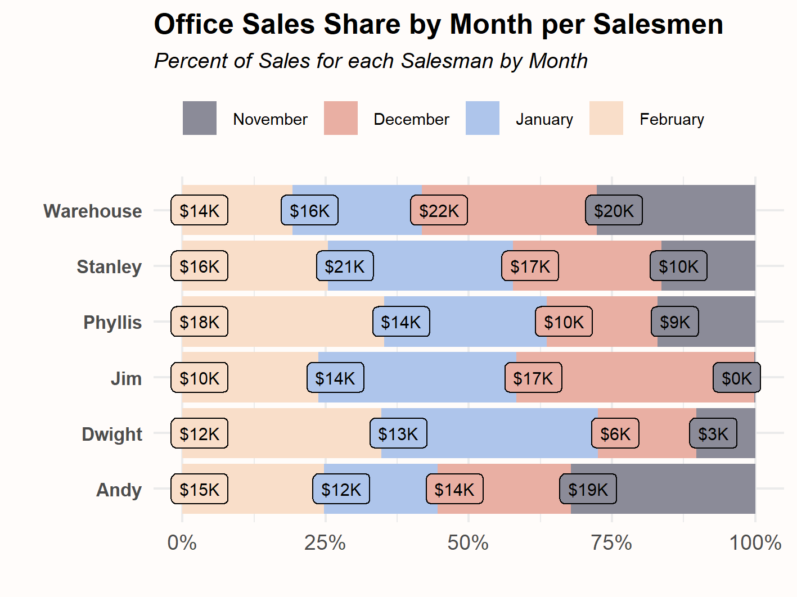

# Bar & Column Charts

Bar & Column Charts are part of the foundational makeup of dataviz.

## Description

Bar & Column charts are one of the most fundamental visualizations you'll find. They come in various forms but are excellent at comparing values from
discrete groups. They are built in {ggplot} with standard settings but additional transformations of the source dataset can unlock the other forms these charts
take.

Review the files in this sub-folder for examples of practicing with bar-column charts.

## Packages Used

{ggplot2} for the core visualization

{scales} for adjusting the axis label format

{foracat} for reversing the order of the factor
