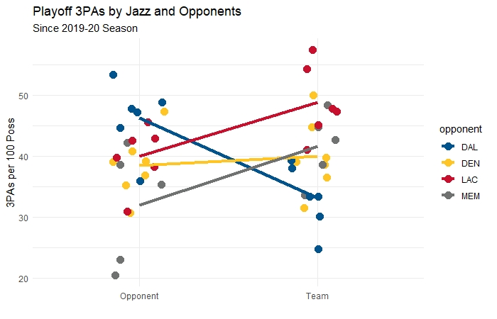

# Dot Distribution Plot

I love boxplots to show distributions, but often we want to preserve the individual observations, particularly with small sets. I recently had a visualization challenge
where I wanted to compare small sets across two levels. The data I used was for Utah Jazz Playoff games in which they attempted and defended three-point attempts.

I put together a neat plot, experimenting with various simple and complex styles to show distributions of the sets while preserving the overservations and judging
interactions with the data using Stat Summary lines.

## Description

We can see pretty clearly the advantages of a dot distribution plot for comparison of multiple sets across various values. My main use of this type of a plot is for
interaction analysis in statistics (does attribute "A" matter for some attribute "B" and not others)?
Review the files in this sub-folder for examples of basic to complex Dot Distribution plots.

## Resources I Used to Learn & Practice

[ggplot Geom_Jitter](https://ggplot2.tidyverse.org/reference/geom_jitter.html)

[Mean Stat Summary](https://stackoverflow.com/questions/21239418/use-stat-summary-in-ggplot2-to-calculate-the-mean-and-sd-then-connect-mean-poin)
