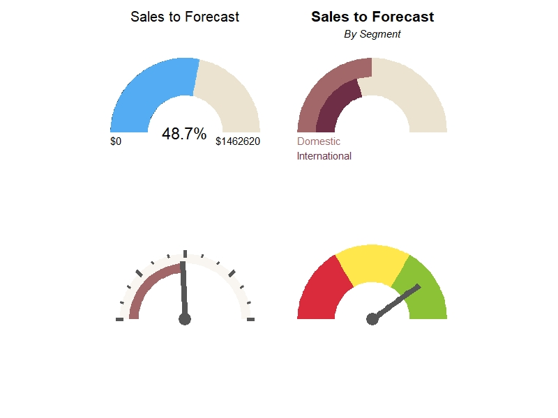

# Gauge Plots

Gauge plots are a neat tool for measuring a dynamic, numerical data point towards a goal. I dive into creating them in {ggplot2}. 

## Description

We use gauges every day when driving our car! They measure progress towards a goal and provide context to the data point in question (i.e. speed in mph). 
Gauges aren't a typical chart you might think to build in {ggplot} but by using a polar coordinate plane instead of a cartesian plane, we can use a band spanning the
first and second quadrants to make the chart.

Review the files in this sub-folder for examples of practicing with gauges. Also check out a recent #TidyTuesday submission where I used faceted gauges to measure
[European Airline Recovery](https://github.com/adambushman/tidytuesday-contribs/tree/main/wk28-22_european-flights), including a custom gauge legend.

## Core Packages I Used to Learn & Practice

{ggplot2} for the entire visualization

## Additional Resources I Used to Learn & Practice

[How To Build Gauges](https://pomvlad.blog/2018/05/03/gauges-ggplot2/)
