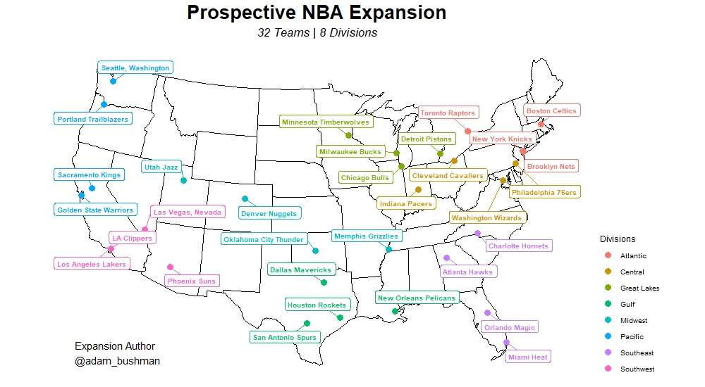

# Geographic Plots

Geographical plotting is pretty involved, but understanding and using the pieces makes for some incredible visualizations. 

## Description

Creating visualizations geographically and making useful maps has always fascinated me. A couple  years ago I made an 
[animated visualization](https://youtu.be/4E-9ukSiqx4) in Tableau depicting the location and timing of construction of world temples by my church, 
The Church of Jesus Christ of Latter-day Saints. While I was happy at the time with the result, I always felt there was more to be explored in this real.

Since that point I've learned R and begun to play around with geographical plotting packages for small things. A recent hobby project with NBA franchises presented 
itself and I took the opportunity to learn and practice more geocoding. 

We can see pretty clearly the advantages of geo-plotting with maps. For the US, 50 values for particular charts can get very cumbersome and location reference 
(distance, proximity, etc.) are really only communicated through plotting with maps. From points to entire entire areas, I experiment with all sorts of ways to 
visualize geographical data.

Review the files in this sub-folder for examples of practicing with basic maps to full-on projects using advanced visualizations.

## Core Packages I Used to Learn & Practice

{usmap} and {tigris} for constructing country, state, county borders for plotting

{ggmap} for extracting longitude/latitude values for various locations

{ggplot2} for additional layers and themes

## Additional Resources I Used to Learn & Practice

[US Map Package Documentation](https://github.com/pdil/usmap)

[US Map | Advanced Mapping Documentation](https://cran.r-project.org/web/packages/usmap/vignettes/advanced-mapping.html)

[Geocoding in R](https://towardsdatascience.com/breaking-down-geocoding-in-r-a-complete-guide-1d0f8acd0d4b)
