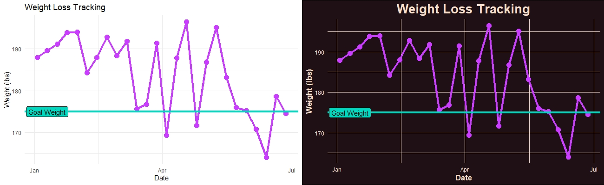

# ggplot Themes

Visualizations are powerful, but require careful construction to communicate the right insights. From spacing to colors, text to size, dimensions to legends, every 
component of a visual should captivate the user's interest.

For a while I've defaulted to the "theme_minimal()" from {ggplot2}. It's simple, elegant, and multi-purpose. However, in the spirit of designing visualizations to 
accomplish the objective above, I've made it my mission to learn and practice adjusting themes and ultimately designing a them from scratch. 

I put generated some source data, a basic plot on which to experiment with themes, and began to change various theme elements, ultimately making a custom ggplot theme
as an option for standard branding.

## Description

We can see pretty clearly the advantages of simple vs custom themes. For quick plots, tutorials, etc., the default {ggplot2} themes are fantastic. A custom theme has 
the strength of being able to highlight insights from the visualization and more appropriate captivate the user.

Review the files in this sub-folder for examples of basic theme adjustments to a full-on theme design for use with various visualization types.

## Resources I Used to Learn & Practice

[TidyVerse Themes]([https://ggplot2.tidyverse.org/reference/geom_jitter.html](https://ggplot2.tidyverse.org/reference/theme.html)

[Data Camp | Intro to Themes](https://www.youtube.com/watch?v=0D0HKmt8g4M)

[R-pubs | Custom Themes](https://rpubs.com/mclaire19/ggplot2-custom-themes)
