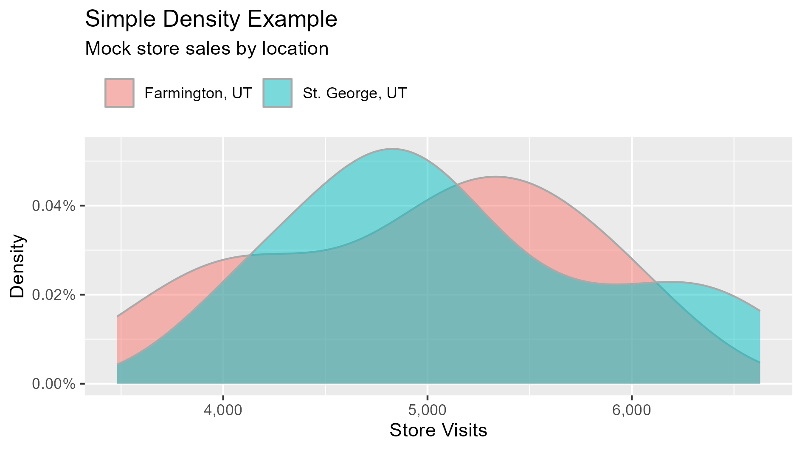
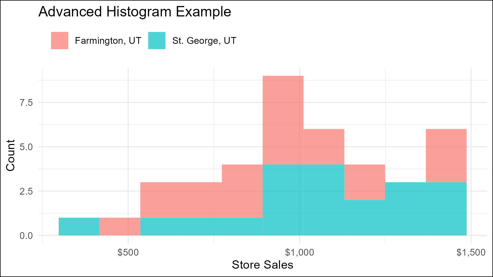
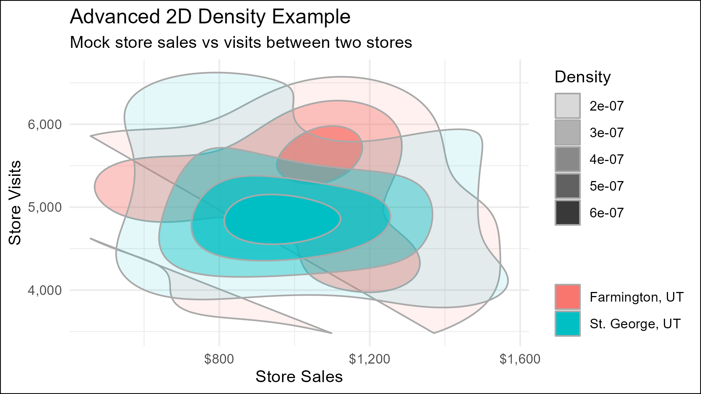

# Histogram & Density Charts

Histogram & Density charts are a classic view into the distribution of data.

## Description

Histogram & Density charts are a go-to for visualizing the distribution of data. They've become especially more popular as awareness grows about the weaknesses of the legacy boxplot. They are built in {ggplot} with standard settings.

Review the files in this sub-folder for examples of practicing with histogram and density charts.

## Packages Used

{ggplot2} for the core visualization

{scales} for adjusting the axis label format

