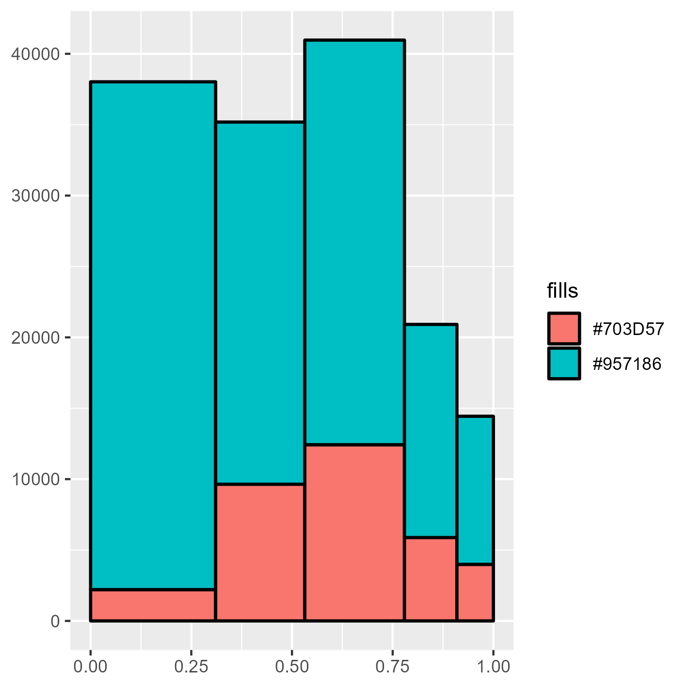
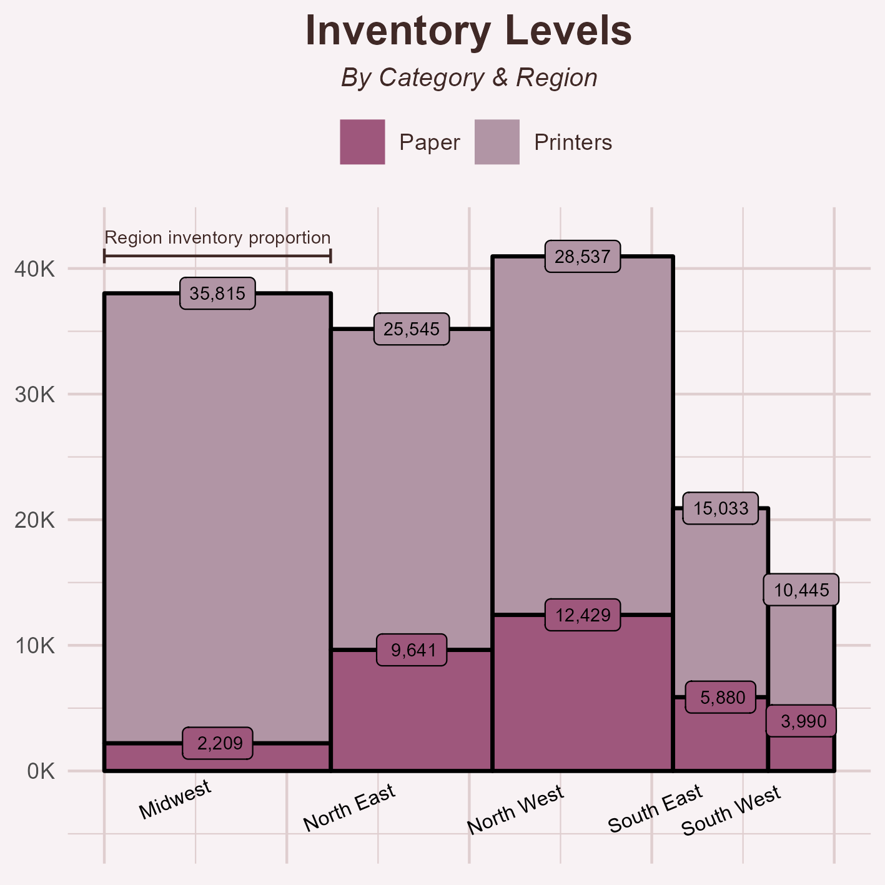

    <table>
	    <tr>
            <td style="padding:10px">
            	
            </td>
            <td style="padding:10px">
            	
            </td>
        </tr>
    </table>

# Mosaic Plots

Mosaic plots are a neat option that blends the proportional benefits of tree maps with traditional bar/column plots. 

## Description

I've found myself using mosaic plots quite a bit recently as a way to communicate an additional dimension of information by scaling one of the two axes to the proportions of a particular field. 
This type of plot does require some additional training on and annotation within the visualization but can allow a lot of customization. I took a stab at creating a mosaic plot in {ggplot2} demonstrating these elements.

Review the files in this sub-folder for examples of practicing mosaic plots.

Upon building mosaic plots by hand, I found a neat package I practice with as well: [{ggmosaic}](https://haleyjeppson.github.io/ggmosaic/articles/ggmosaic.html)

## Core Packages I Used to Learn & Practice

{ggplot2} for the visualization
{ggrepel} for some advanced labels
{scales} for label formatting

## Additional Resources I Used to Learn & Practice

[Mosaic/Marimeko Charts](https://learnr.wordpress.com/2009/03/29/ggplot2_marimekko_mosaic_chart/)
