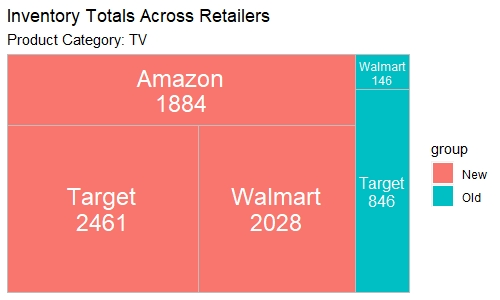

# Tree Map

I've been looking for an opportunity to implement a tree map in a project and such a situation arose recently at work.

I was asked to prepare some regular tools to report on the status of inventory across retailers for different product families shifting from an old style 
to that of a new. This seemed like the perfect use for a tree map.

## Description

Tree maps are the best combination of stacked column and pie charts when working with a lot of categories and sub categories. We can see pretty clearly 
the advantages of a tree map for this situation. Not only do we retain proportions, can customize labels/colors, but we retain sub-grouping and labeling 
which is a massive help as the "whole" has many "parts" and "sub-parts".

Review the files in this sub-folder for examples of basic to complex Tree Maps.

## Resources I Used to Learn & Practice
[{treemapify} Documentation](https://wilkox.org/treemapify/reference/geom_treemap_subgroup_text.html)

[June Cho - Best Approaches to Treemap in R](https://yjunechoe.github.io/posts/2020-06-30-treemap-with-ggplot/)

[RPubs - Treemap in ggplot](https://rpubs.com/techanswers88/treemap_ggplot)
