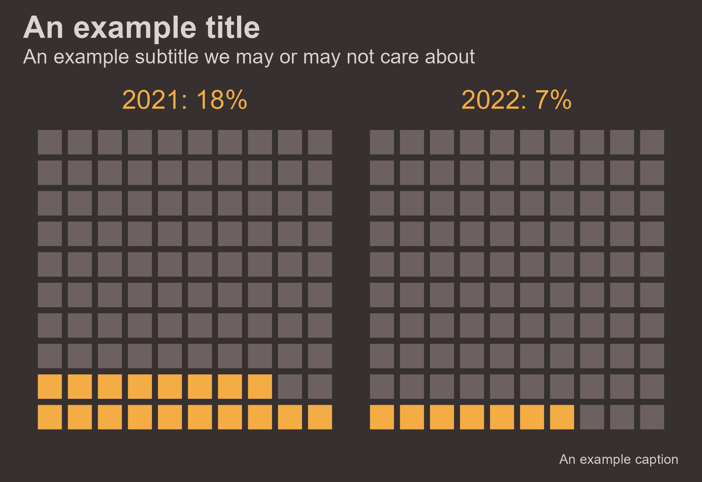
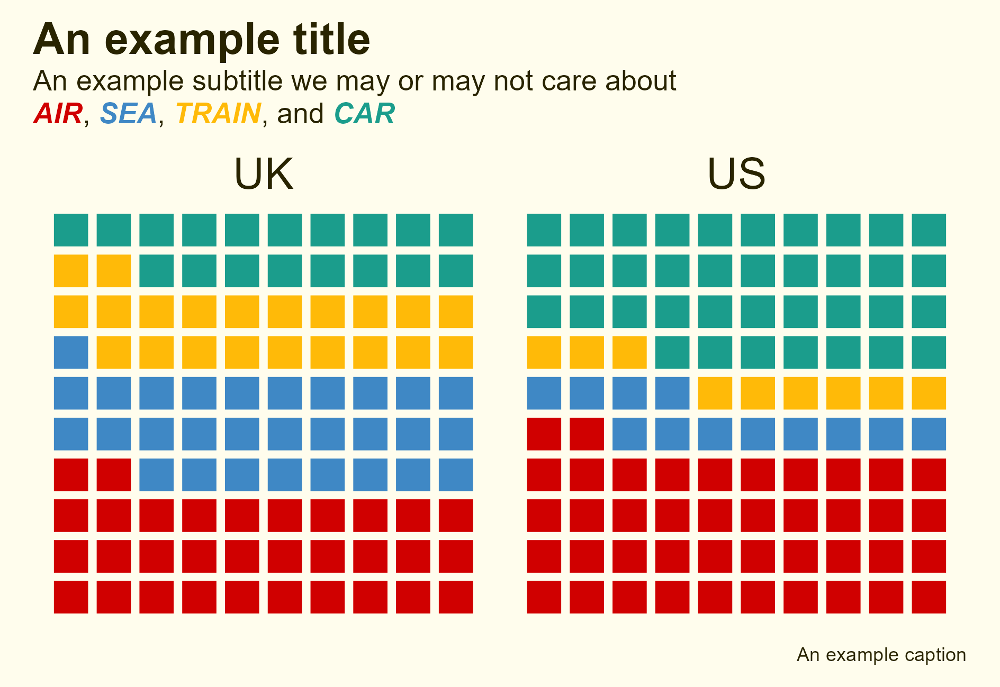

# Waffle Charts

Waffle Charts are a lesser recognized data viz form but excel in displaying small parts of a grand whole.

## Description

Waffle Charts aren't very common but they really shine when displaying small parts of a whole. Instead of showing a pie chart or even column chart for a category with a value of, say, 7%, a waffle chart communicates far better.

While there are packages in {ggplot} to help create waffle charts, a little ingenuity results in a tidy workflow to make htem in short order.

Review the files in this sub-folder for examples of practicing with waffle charts.

## Packages Used

{ggplot2} for the core visualization

{camcorder} for rendering the visualization

{ggtext} for creating a styled subtitle

{tidyverse} for miscellaneous data transformation
