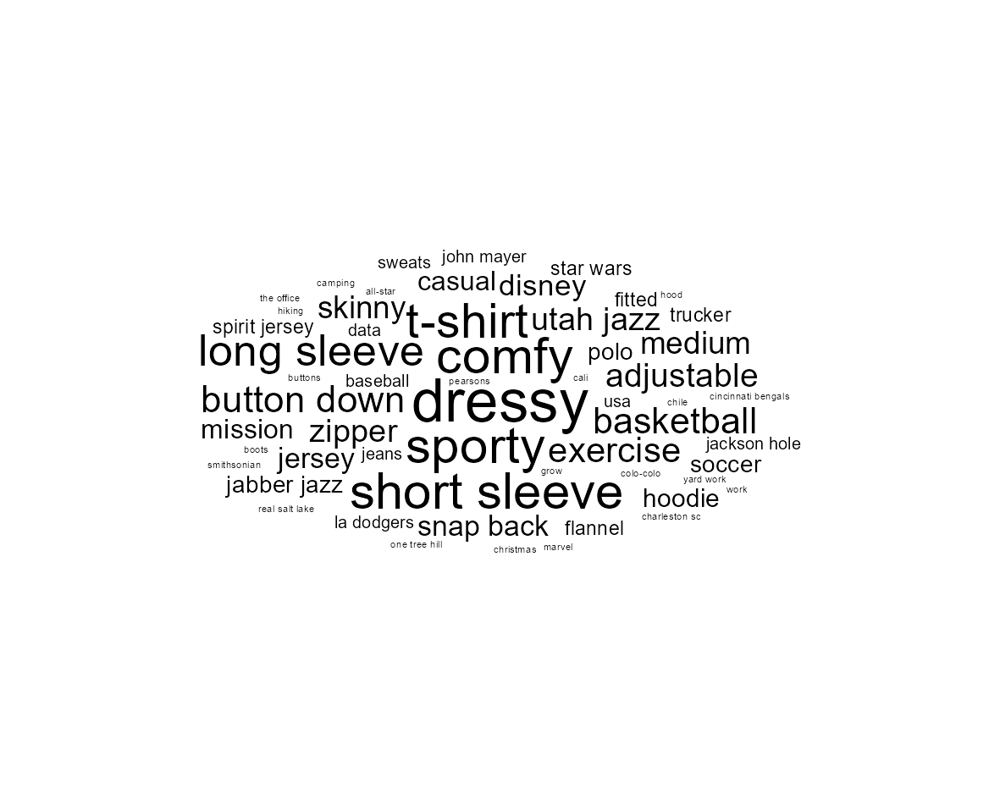
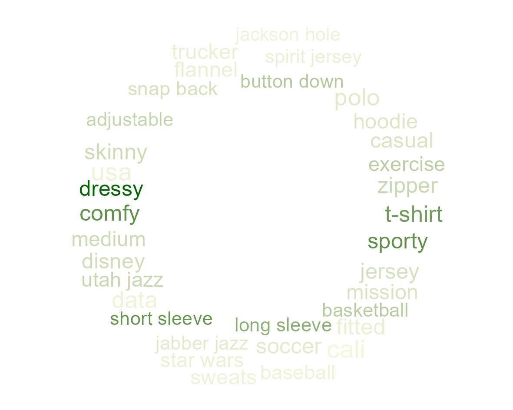
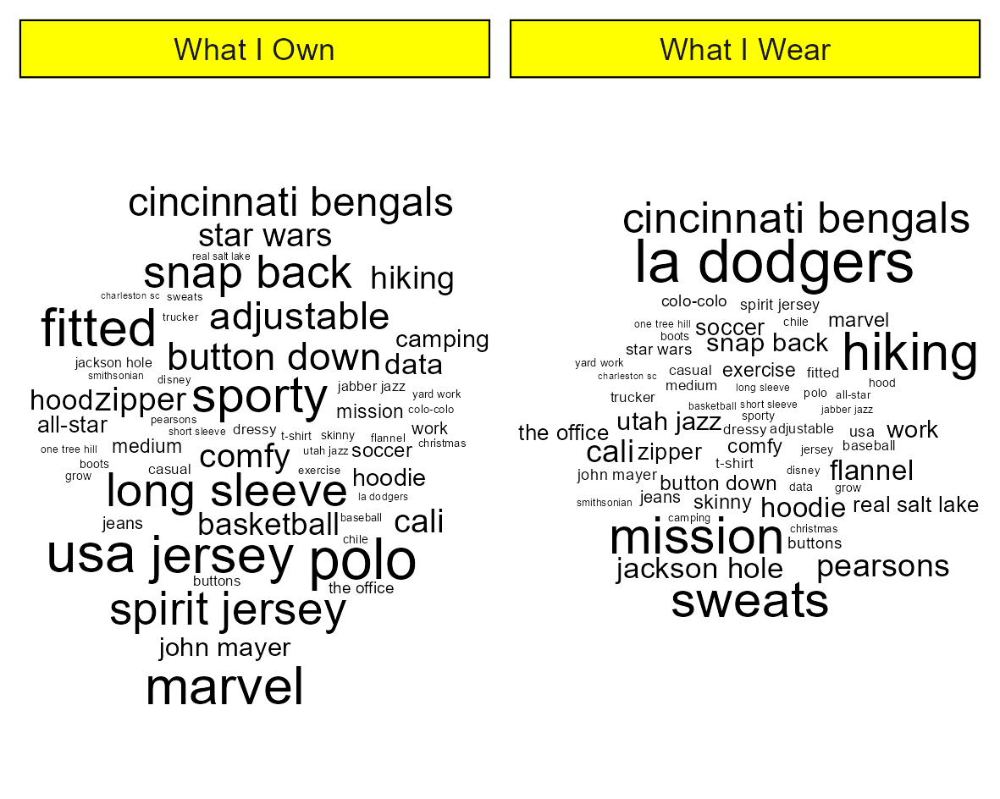

    <table>
	    <tr>
            <td style="padding:10px">
            	
            </td>
            <td style="padding:10px">
            	
            </td>
            <td style="padding:10px">
            	
            </td>
        </tr>
    </table>

# Word Cloud Charts

Word cloud charts are a fun and helpful way to visualize text, especially when there's too much to categorize.

## Description

Word clouds are really popular when working with social media data. Scrapping twitter data, for example, and creating a word cloud is a neat way to visualize text frequency. They're a fantastic example of data visualization intersecting art and analysis.
I've previously created word clouds using the {wordcloud} package but found it to be difficult to work with. Instead, I dove into the documentation for the TidyVerse word cloud package {ggwordcloud} and experimenting with the features.

Review the files in this sub-folder for examples of practicing word cloud charts.

## Core Packages I Used to Learn & Practice

{ggwordcloud} for geoms to create word clouds
{ggplot2} for the visualization basis

## Additional Resources I Used to Learn & Practice

[{ggwordcloud} Documentation](https://cran.r-project.org/web/packages/ggwordcloud/vignettes/ggwordcloud.html)
